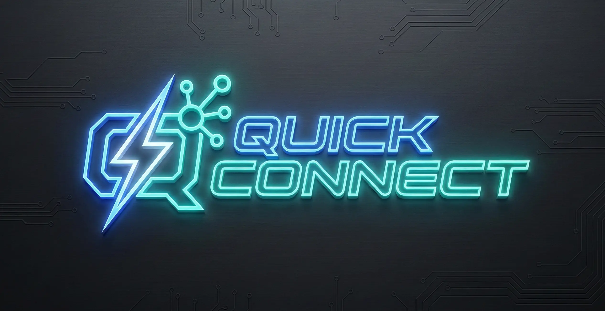

  

  <h1>Quick Connect</h1>

  

    <b>Better Communication, More Customers. Quick Connect Cloud Platform.</b>
  

  
  
  

---

## 📖 About Quick Connect
## ✨ Key Features
## 🚧 Roadmap & Upcoming Features
## 🏗️ Architecture
## 🛠️ Tech Stack
## 🚀 Get Started
## 📚 Documentation
## 🤝 Contributing
## 📄 License