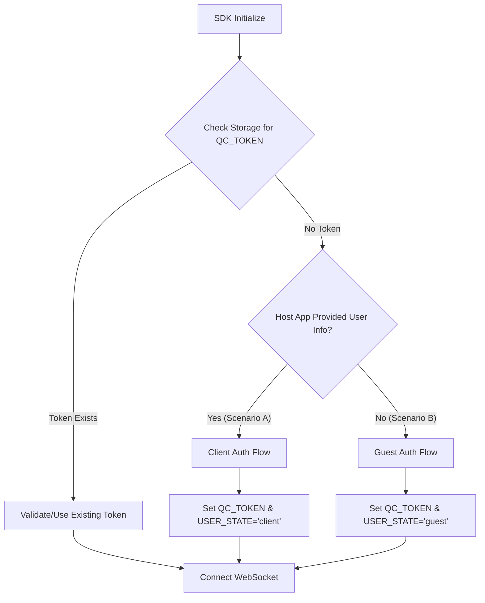

# Quick Connect SDK Architecture & Implementation Guide

## 1\. Introduction

This document outlines the architecture and implementation flow for the **Quick Connect Chat SDK**. The SDK is designed to be embedded into frontend applications (Web/Mobile) to provide real-time support chat.

The SDK handles authentication transparently, supporting both **Guest Users** (anonymous) and **Identified Clients** (users already logged into the host application).

## 2\. Storage & State Management

The SDK must maintain persistent state across browser sessions/app restarts. It should utilize long-term storage (e.g., `localStorage` for Web, `AsyncStorage` for Mobile).

### Required Storage Keys:

1.  **`QC_TOKEN`**: The JWT authentication token used for API calls and WebSocket connections.
2.  **`QC_USER_STATE`**: Indicates the type of the current user.
    * Values: `'guest'` | `'client'`

-----

## 3\. Initialization Flow

When the SDK initializes, it must execute the following logic decision tree to determine how to authenticate:

### Logic Diagram



-----

## 4\. Authentication Scenarios

### Scenario A: Identified Client (Host App Integration)

This flow is used when the user is already logged into the main application (e.g., an Online Shop). The SDK identifies the user via the backend to link the chat history to their account.

1.  **Host App Action:** The host application detects a logged-in user.
2.  **Backend-to-Backend Call:** The host application's backend calls the Quick Connect Manager Internal API.
    * **Endpoint:** `POST /auth/identify-client?APIKey={SECURE_KEY}`
    * **Body:** User details (External ID, Name, etc.):
      ```json
      {
        "email": "string",
        "fullname": "string",
        "phone_number": "string",
        "user_id": "string"
      }
    ```* **Response:** Returns a `token` (QC\_TOKEN).
3.  **SDK Action:** The host frontend passes this token to the SDK (e.g., `QuickConnectSDK.login(token)`).
4.  **State Update:**
    * Save `QC_TOKEN` = `token`
    * Save `QC_USER_STATE` = `'client'`

### Scenario B: Guest User (Anonymous)

This flow is used when a visitor opens the site but is not logged in.

1.  **SDK Action:** The SDK detects no existing token and no host-provided token.
2.  **API Call:** The SDK calls the public Guest Register endpoint.
    * **Endpoint:** `POST {MANAGER_URL}/users/guest/register`
    * **Body:**
      ```json
      {
        "fullname": "Guest User",       // Optional or default
        "email": "guestuser@gmail.com", // Optional or default
        "phone_number": "+44121585"     // Optional or default
      }
      ```
3.  **Response:** Server returns the `token`.
4.  **State Update:**
    * Save `QC_TOKEN` = `token`
    * Save `QC_USER_STATE` = `'guest'`

-----

## 5\. Guest Features

If the user is in the **Guest** state (`QC_USER_STATE === 'guest'`), the UI should enable specific features, such as updating contact information.

### Update Guest Profile

The SDK should provide a method (and UI) to update the guest's details (e.g., name, phone number) so support agents can follow up.

* **Condition:** Only execute if `QC_USER_STATE === 'guest'`.
* **API Call:** `PUT {MANAGER_URL}/users/guest/update`
* **Headers:** `Authorization: Bearer <QC_TOKEN>`
* **Body:**
  ```json
  {
    "fullname": "John Doe",
    "email": "johndoe@gmail.com",
    "phone_number": "+123456789"
  }
  ```
* **UI Suggestion:** Show a "Complete Profile" banner or form inside the chat window.

-----

## 6\. WebSocket Connection

Once the `QC_TOKEN` is obtained (via either scenario), the SDK establishes the real-time connection.

### Connection Details

* **URL:** `ws://{CHAT_URL}/v1/chats/clients`
* **Handshake Authentication:** The SDK **must** send the token during the handshake.
    * *Browser Constraints:* Standard WebSocket API does not support custom headers easily.
    * *Recommended Approach:* Send the token as a Protocol or Query Parameter (if supported by backend), or ensure the token is set in a **Cookie** that is automatically sent with the request.
    * *Current Backend Implementation:* The backend middleware looks for the token in Headers or Cookies. Ensure the HTTP client logic that got the token also sets it effectively for the WS upgrade request.

### Connection Logic

1.  **Connect:** Open socket to `/v1/chats/clients`.
2.  **Event Listeners:**
    * `onOpen`: Connection established. Set UI to "Online".
    * `onMessage`: Parse JSON message (See Chat API Docs).
    * `onClose`: Connection lost. **Implement Reconnection Strategy** (Exponential backoff: 1s, 2s, 5s...).
    * `onError`: Handle authentication errors (e.g., invalid token).

-----

## 7\. API Endpoint Reference

These endpoints are required for the SDK implementation.

### Manager Service (Authentication)

| Method | Endpoint | Auth Required | Description |
| :--- | :--- | :--- | :--- |
| **POST** | `/users/guest/register` | No | Registers a new guest and returns a token. |
| **PUT** | `/users/guest/update` | **Yes** (JWT) | Updates the guest's profile information. |
| **POST** | `/auth/identify-client` | **API Key** | **Internal Use Only.** Called by Host Backend to get a token for logged-in users. |

### Chat Service (Real-time)

| Method | Endpoint         | Auth Required | Description |
| :--- |:-----------------| :--- | :--- |
| **GET** | `/chats/clients` | **Yes** (JWT) | WebSocket endpoint for both Guests and Clients. |

-----

## 8\. Implementation Checklist for SDK Developers

1.  [ ] **Storage Adapter:** Implement a wrapper around `localStorage`/`AsyncStorage`.
2.  [ ] **Auth Manager:** Implement the logic to check for tokens and decide between Guest Register or Client Login flows.
3.  [ ] **HTTP Client:** Configured with `BaseURL` for Manager Service and automatic `Authorization: Bearer ...` header injection.
4.  [ ] **WebSocket Client:**
    * Handle Connection/Reconnection.
    * Handle "Typing" logic (throttling).
    * Handle incoming message dispatching.
5.  [ ] **Public API:** Expose methods for the Host App:
    * `init({ authType, clientToken, ... })`
    * `open()` / `close()`
    * `updateGuestProfile({...})`